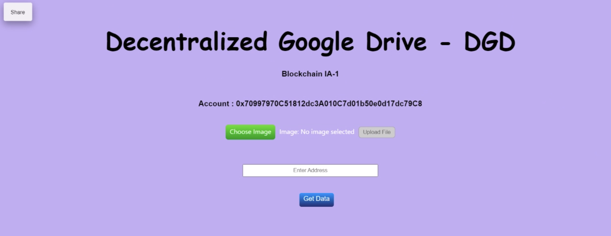

# DGD - Decentralized Google Drive 

Our Application is a decentralized version of google drive, we are planning to make a file system which can make it easy to share images just like Google drive but in a more secure manner by using blockchain.

### Features

-> Image Stored a on an IPFS Network 

-> Enabling sharing images with others

-> Connected Metamask account

-> Enabled users to view images which they have access of

-> Established a secure way to share images among users

### Technology Stack

-> Pinata to store images whose hash will be used as an URL in the smart contract

-> React based UI

-> Ether.js

-> Hardhat

-> Metamask for account

-> Solidity

### Implementation

